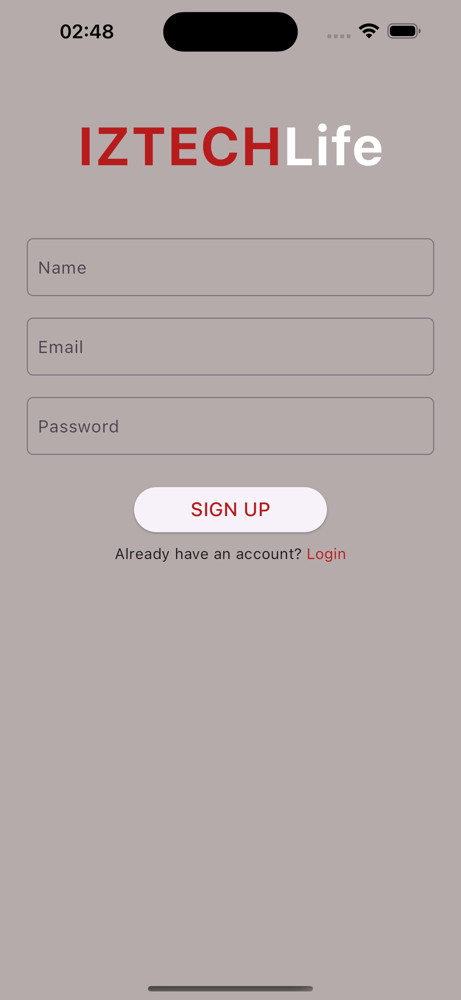
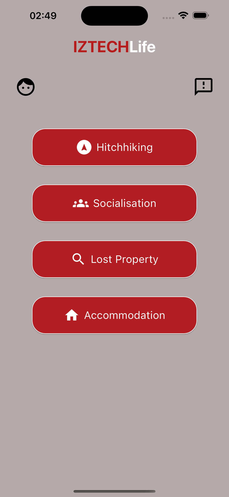

# IZTECHLife 
## Login Page - Sign Up Page

  
  

## Forgot Password Page - Main Page

  
  

## Profile Pages

  
  

  

## Feedback Pages

  
  

## Hitchhiking Pages

  
  

  
  

  
  

  
  

  
  

## Socialisation Pages

  
  

  
  

  
  

  
  

  
  

## Lost Property Information Pages

  
  

  
  

  
  

## Accommodation Pages

  
  

  
  

  
  

